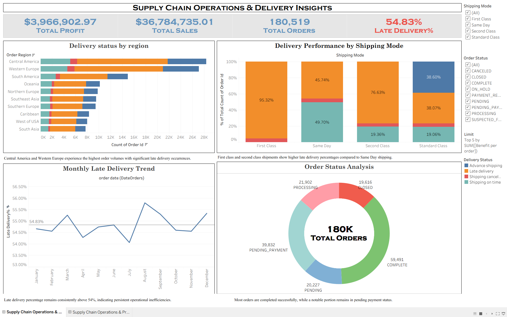
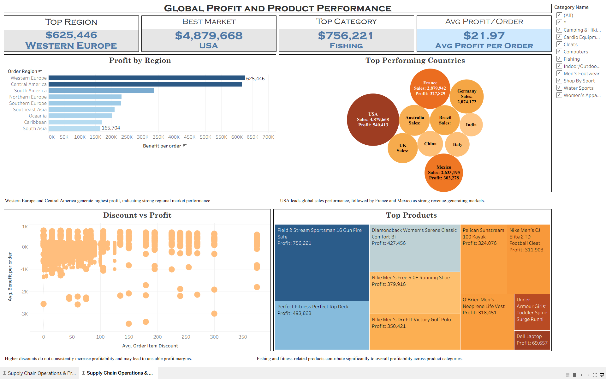

# **Supply Chain Operations & Profitability Analysis**
  **Project Overview**

This project focuses on analyzing supply chain operations, delivery performance, profitability trends, and product performance using Python, DuckDB SQL, and Tableau.

The goal of this analysis was not only to create dashboards, but also to understand the actual business problems hidden inside the data, especially delivery inefficiencies, late shipment patterns, discount impact on profitability, and high-performing products and regions.

Using SQL-based analysis and visualization techniques, the project identifies operational bottlenecks and profitability drivers that can help businesses make better supply chain decisions.

# Dashboard Preview

## Supply Chain Operations & Delivery Insights

---

## Global Profit & Product Performance Analysis

**Tools & Technologies Used**

* Python
* DuckDB SQL
* Pandas
* Tableau Public
* CSV Dataset

# **Project Workflow**
# **1. Data Collection**

The project started with a raw supply chain dataset containing

* Orders
* Shipping details
* Delivery status
* Product categories
* Regions and markets
* Profit and discount information

# **2. Data Cleaning & Preparation**

Using Python, the dataset was cleaned and transformed before analysis.

* Cleaning Tasks Performed
* Removed inconsistencies in date formats
* Handled null and duplicate values
* Standardized column formatting
* Created cleaned dataset for analysis and visualization

# **3. SQL Analysis Using DuckDB**

DuckDB SQL was used to derive business insights from the cleaned dataset.

Several analytical queries were written to investigate

* Delivery status distribution
* Shipping mode performance
* Late delivery percentages
* Regional inefficiencies
* Discount vs profit relationship
* Monthly late delivery trends
* Scheduled vs actual shipping delays
* Region-wise and category-wise profits

**Key Business Insights**
**Supply Chain & Delivery Insights**
* More than 54% of orders experienced late delivery, indicating major operational inefficiencies.
* First Class and Second Class shipping modes showed higher late delivery percentages compared to Same Day shipping.
* Central America and Western Europe had the highest order volumes along with significant late deliveries.
* Actual shipping days were frequently higher than scheduled shipping days, creating delivery gaps.
  

**Profitability Insights**
* Higher discounts did not consistently improve profitability.
* In many cases, larger discounts resulted in lower profit margins.
* Categories like Fishing, Computers, and Strength Training generated strong profits.
* Western Europe and Central America emerged as highly profitable regions.

**Product & Market Insights**
* USA generated the highest overall sales and profit.
* France and Mexico also contributed strongly to revenue generation.
* Certain products significantly outperformed others in profitability and sales contribution.
  

# **Tableau Dashboard Development**

Two interactive dashboards were created in Tableau to separate

1  **Operational Performance Analysis**

2  **Profitability & Product Performance Analysis**

This separation helped maintain dashboard clarity and improved analytical storytelling.

# **Dashboard 1 — Supply Chain Operations & Delivery Insights**
 Focus Areas
* Delivery status by region
* Shipping mode performance
* Monthly late delivery trends
* Order status analysis
* Operational KPIs
  
 Business Objective

**This dashboard helps identify**

* Regions facing delivery inefficiencies
* Shipping modes causing operational delays
* Monthly delivery performance fluctuations
* Order completion and pending patterns

# **Dashboard 2 — Global Profit & Product Performance**
Focus Areas
* Profit by region
* Top-performing countries
* Discount vs profit relationship
* Top-performing products
* Profitability KPIs

Business Objective

**This dashboard helps in understanding**

* Which markets generate the highest profit
* Which products contribute most to business performance
* How discount strategies impact profitability
* Which categories drive long-term revenue growth

# **What I Learned From This Project**

Through this project, I improved my understanding of

* SQL-based business analysis
* Supply chain performance evaluation
* Delivery inefficiency analysis
* Profitability analysis
* Dashboard design and storytelling
* Data cleaning workflows
* Business-focused decision making using data

More importantly, this project helped me understand how raw operational data can be transformed into meaningful business insights that support strategic decisions.

# **Conclusion**

This project demonstrates how data analytics can be used to uncover hidden operational inefficiencies and profitability patterns within a supply chain system.

The analysis revealed that late deliveries remain a major operational challenge, while aggressive discounting strategies do not always translate into better profitability. At the same time, certain regions, markets, and product categories consistently contribute higher business value.

By combining Python, DuckDB SQL, and Tableau, the project provides both technical analysis and business-oriented insights that can help organizations

* improve delivery performance
* optimize shipping operations
* refine discount strategies
* focus on high-performing products and markets

This project was built as an end-to-end analytics workflow covering

* data cleaning
* SQL analysis
* business interpretation
* dashboard visualization
